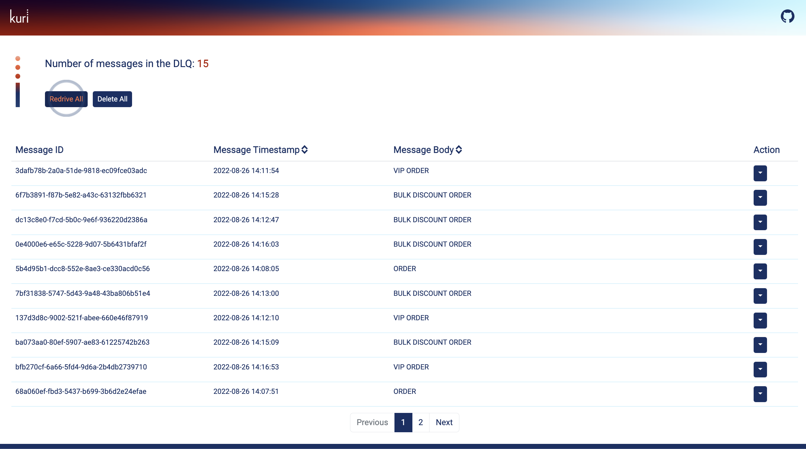

# Batch Actions

Kuri provides two batch operations for users. They can either `Redrive All` messages back to the main queue or `Delete All` messages from the dead-letter queue. Redriving sends the message from the dead-letter queue back to the main queue.

