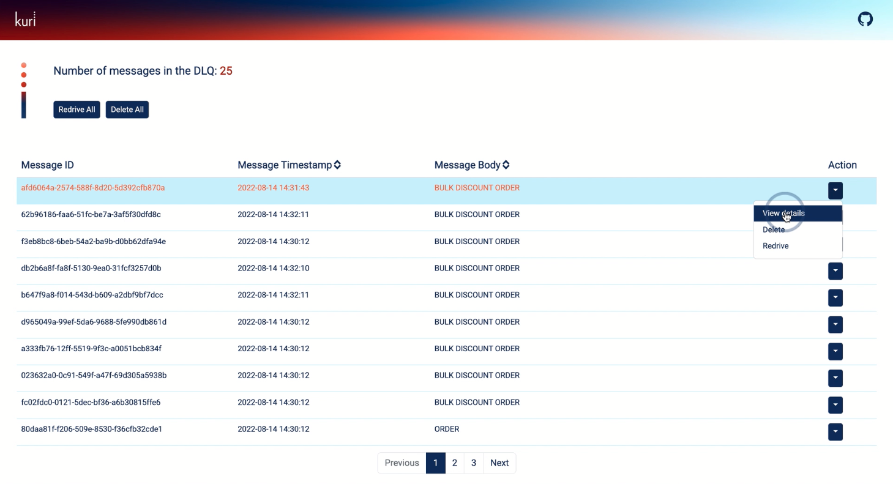

# Individual Actions

By clicking on the `Action` drop-down button located at the end of each message row, the developer can either `View details` of the message or `Delete` or `Redrive` the individual message.

