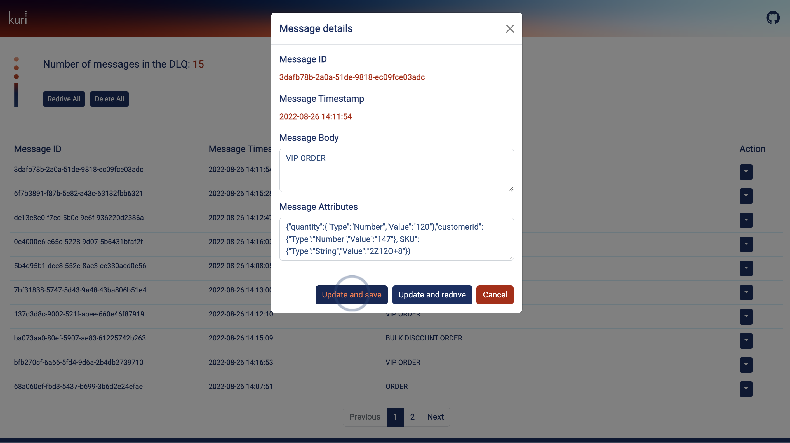

# Message Details

By clicking the `View details` option within the individual message actions a modal will appear. Here the user can edit
the message body and/or attributes. There are also options to `Update and save` and `Update and redrive` the message. Clicking `Cancel` will exit the modal.

