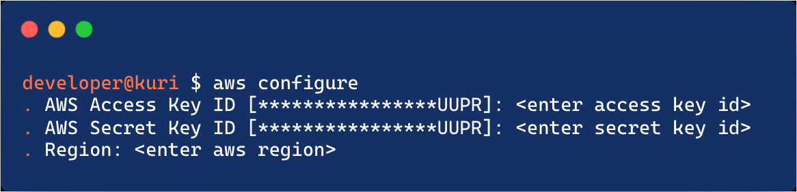

# Prerequisites
1. Install the AWS Command Line Interface - must be installed, up-to-date and configured. To install the AWS CLI see instructions: https://docs.aws.amazon.com/cli/latest/userguide/getting-started-install.html 

  To configure the AWS credentials:
  

2. Install NodeJS version 12 or greater - see the NodeJS documentation for instructions: https://nodejs.org/en/download/