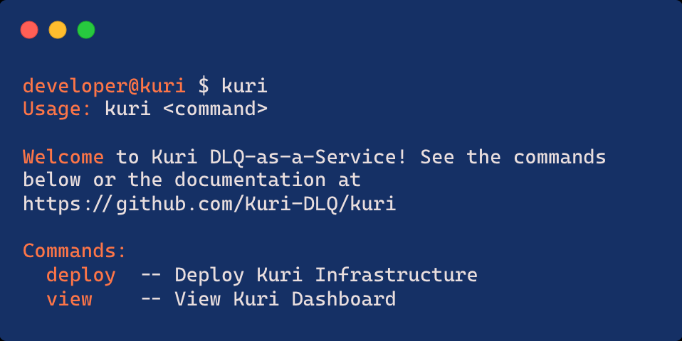
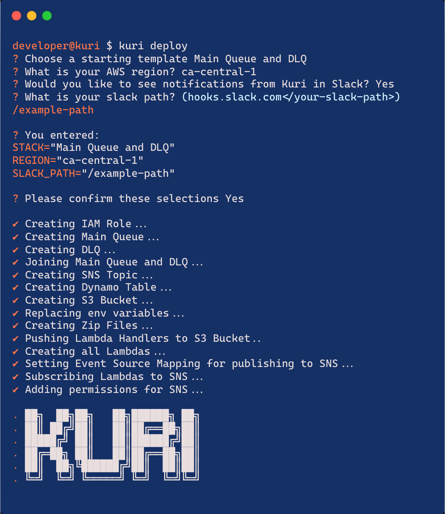
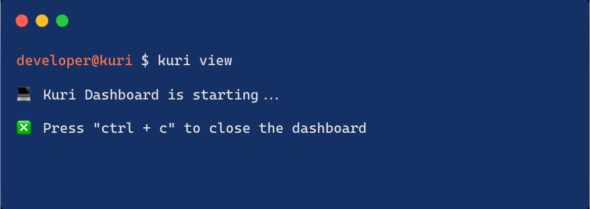

# Usage
To install Kuri, run the following command globally:

To view the Kuri help commands, run the `kuri` command:

To deploy the Kuri DLQ service, the user can run the `kuri deploy` command and will be prompted with the following initializing questions.

1. `Choose a starting template` -- they can either choose for Kuri to create a "Main Queue and DLQ" for a brand new project or if they want to add Kuri to an existing project that already has a main queue, they can select the "DLQ Only" option. If they choose "DLQ Only", they will be prompted to provide the existing main queue url.
2. `What is your AWS region?` -- provide the AWS Region. This needs to be the same region that the project is deployed in and the AWS CLI it is configured to.
3. `Would you like to see notifications from Kuri in Slack?` -- if the user chooses to receive a Slack notification when a message appears in the Kuri DLQ, they can provide a Slack API Webhook Path. For more details, see: https://api.slack.com/apps.

Once the Kuri DLQ has been deployed, the user can run `kuri view` to launch the Kuri Dashboard. Once run, the dashboard should pop open within a minute. ***Note***: sometimes launching the dashboard can take up to a few minutes.

